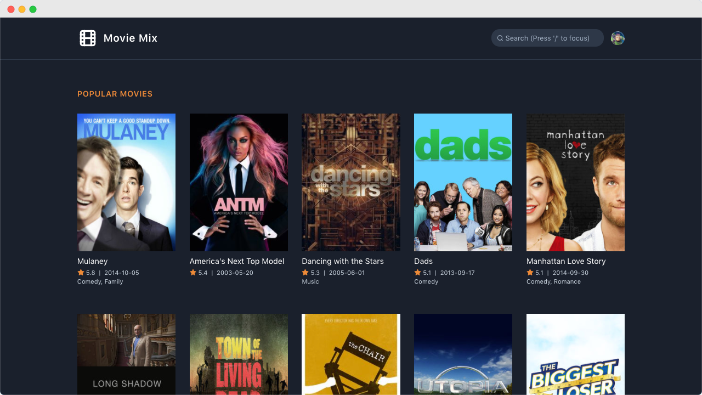

# Movie MIX

Movie MIX is an online collection of tv shows.

<p align="center">
  <a href="https://movie-mix.netlify.app/" target="_blank">
    
    <br>
    Live Demo
  </a>
</p>

### Why VueJS?

- Very less in size and easy to learn.
- It is Reactive because of fast virtual DOM.
- Developers can easily understand and build interactive web interfaces in a matter of time.
- It has marked high stars on GitHub, making it more popular.
- Highly scalable – good for small to large applications.
- Well documented – Documentation is easy to understand
- Better community support.

### Why tailwind CSS?

- Tailwind CSS is a highly customizable, low-level CSS framework that gives you all of the building blocks you need to build bespoke designs without any annoying opinionated styles you have to fight to override.
- Instead of opinionated predesigned components, Tailwind provides low-level utility classes that let you build completely custom designs without ever leaving your HTML.
- Every Tailwind utility also comes with responsive variants, making it extremely easy to build responsive interfaces without resorting to custom CSS.
- Tailwind provides tools for extracting component classes from repeated utility patterns, making it easy to update multiple instances of a component from one place.
- Tailwind is written in PostCSS and configured in JavaScript, which means you have the full power of a real programming language at your fingertips.

## Project setup

```
yarn install
```

### Compiles and hot-reloads for development

```
yarn serve
```

### Compiles and minifies for production

```
yarn build
```

### Run your unit tests

```
yarn test:unit
```

### Lints and fixes files

```
yarn lint
```

### Customize configuration

See [Configuration Reference](https://cli.vuejs.org/config/).
